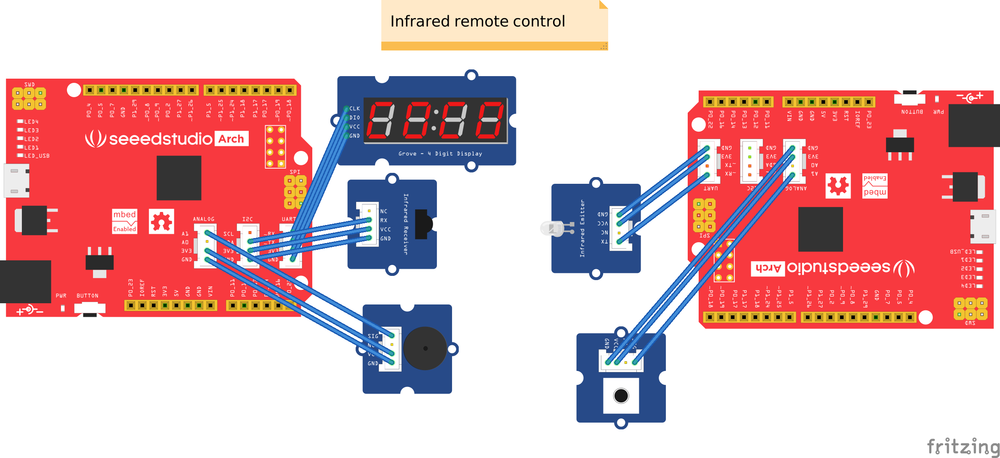

Fritzing Parts of Seeed Hardware
--------------------------------

This is a parts library for [Fritzing](http://fritzing.org/). Download the .fzbz files in this repo and open it in Fritzing to start your creations. 
Here is the growing list of the Seeed Studio products that you can find their Fritzing Parts in this repo:
- Seeed Studio XIAO Dev Boards, including [XIAO SAMD21](https://www.seeedstudio.com/Seeeduino-XIAO-Arduino-Microcontroller-SAMD21-Cortex-M0+-p-4426.html), [XIAO RP2040](https://www.seeedstudio.com/XIAO-RP2040-v1-0-p-5026.html), [XIAO nRF52840](https://www.seeedstudio.com/Seeed-XIAO-BLE-nRF52840-p-5201.html), [XIAO nRF52840 Sense](https://www.seeedstudio.com/Seeed-XIAO-BLE-Sense-nRF52840-p-5253.html), [XIAO ESP32C3](https://www.seeedstudio.com/Seeed-XIAO-ESP32C3-p-5431.html), [XIAO ESP32S3](https://www.seeedstudio.com/XIAO-ESP32S3-p-5627.html), [XIAO ESP32S3 Sense](https://www.seeedstudio.com/XIAO-ESP32S3-Sense-p-5639.html), [XIAO ESP32C6](https://www.seeedstudio.com/Seeed-Studio-XIAO-ESP32C6-p-5884.html), [XIAO RP2350](https://www.seeedstudio.com/Seeed-XIAO-RP2350-p-5944.html), [XIAO RA4M1](https://www.seeedstudio.com/Seeed-XIAO-RA4M1-p-5943.html), [XIAO MG24](https://www.seeedstudio.com/Seeed-Studio-XIAO-MG24-p-6247.html), [XIAO MG24 Sense](https://www.seeedstudio.com/Seeed-XIAO-MG24-Sense-p-6248.html), [XIAO ESP32S3 Plus](https://www.seeedstudio.com/Seeed-Studio-XIAO-ESP32S3-Plus-p-6361.html), [XIAO nRF52840 Plus](https://www.seeedstudio.com/Seeed-Studio-XIAO-nRF52840-Plus-p-6359.html), [XIAO nRF52840 Sense Plus](https://www.seeedstudio.com/Seeed-Studio-XIAO-nRF52840-Sense-Plus-p-6360.html)
- Seeed Studio XIAO Add-ons of [Expansions, Sensors, Connectivity Modules, Actuators](https://www.seeedstudio.com/xiao-series-page)
- Seeed Studio Wio-E5 Series LoRa Modules, Dev Boards
- Seeed Studio Grove Modules

Let us know by raising an issue if you want us to add a Fritzing part for some specific Seeed Studio Products. 
Last but not least, a big shout-out to all contributors to this repo, just to name a few [Gokul](https://github.com/gokuxmaker),[vanepp](https://github.com/vanepp). Thank you for your contribution.💚

----

 This work by Seeed Stduio is licensed under a <a rel="license" href="http://creativecommons.org/licenses/by-sa/4.0/">Creative Commons Attribution-ShareAlike 4.0 International License</a>.

Seeed is a hardware innovation platform for makers to grow inspirations into differentiating products. By working closely with technology providers of all scales, Seeed provides accessible technologies with quality, speed and supply chain knowledge. When prototypes are ready to iterate, Seeed helps productize 1 to 1,000 pcs using in-house engineering, supply chain management and agile manufacturing forces. Seeed also teams up with incubators, the Chinese tech ecosystem, investors, and distribution channels to portal Maker startups beyond.

